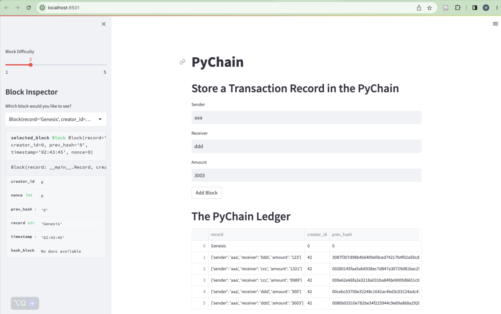
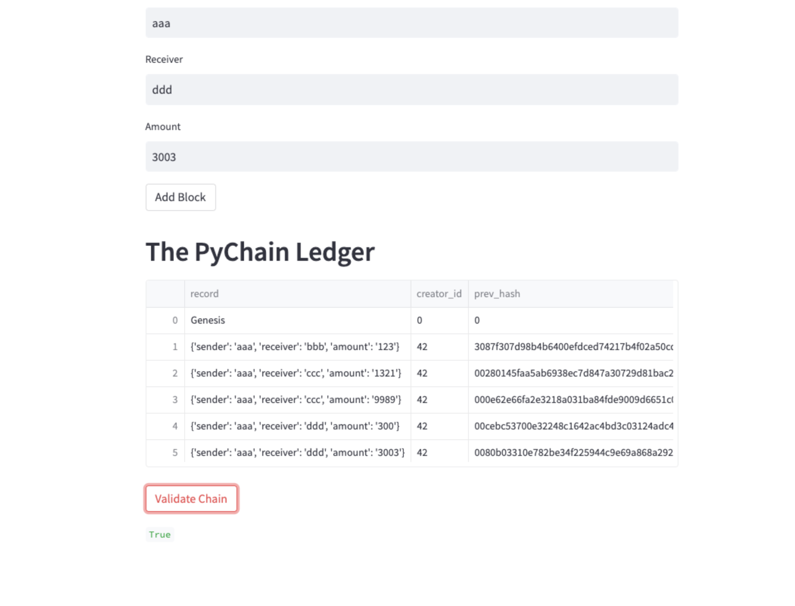
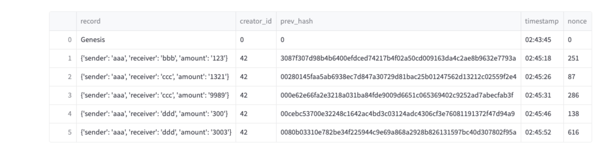

# PyChain Ledger 

## Tasks 

1. Build a blockchain-based ledger system

2. complete with a user-friendly web interface

---

### Step 1: Create a Record Data Class

Define a new Python data class named `Record`. Give this new class a formalized data structure that consists of the `sender`, `receiver`, and `amount` attributes. To do so, complete the following steps:

### Step 2: Modify the Existing Block Data Class to Store Record Data

Rename the `data` attribute in your `Block` class to `record`, and then set it to use an instance of the new `Record` class that you created in the previous section. To do so, complete the following steps:

1. In the `Block` class, rename the `data` attribute to `record`.

2. Set the data type of the `record` attribute to `Record`.

### Step 3: Add Relevant User Inputs to the Streamlit Interface

Code additional input areas for the user interface of your Streamlit application. Create these input areas to capture the sender, receiver, and amount for each transaction that you’ll store in the `Block` record. To do so, complete the following steps:

### Step 4: Test the PyChain Ledger by Storing Records

